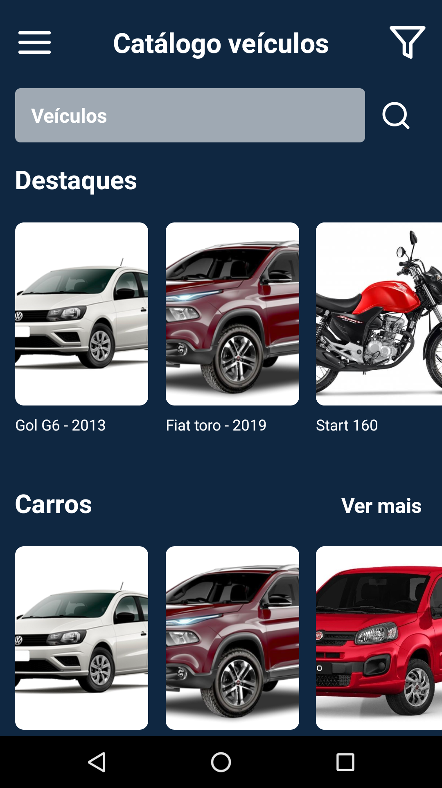
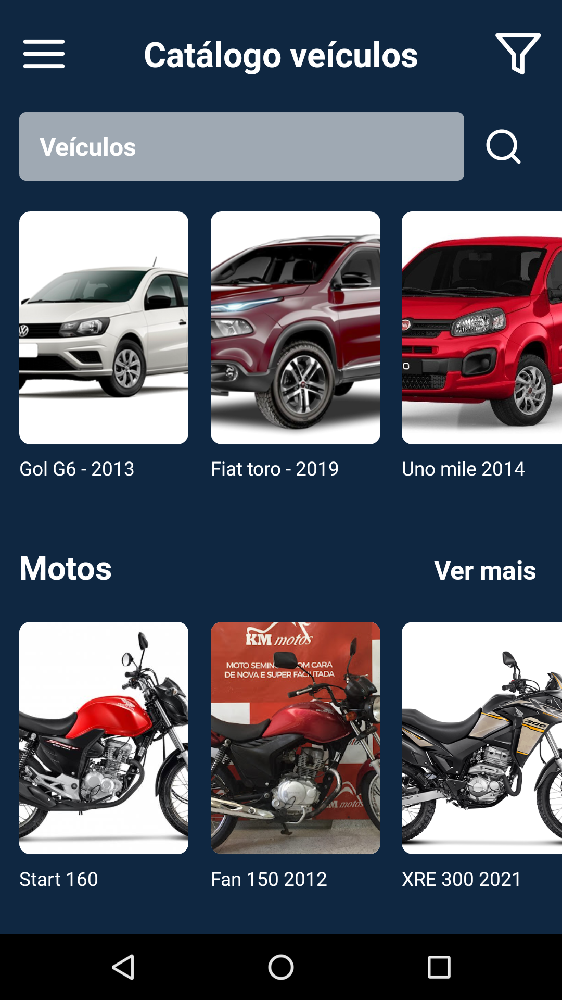
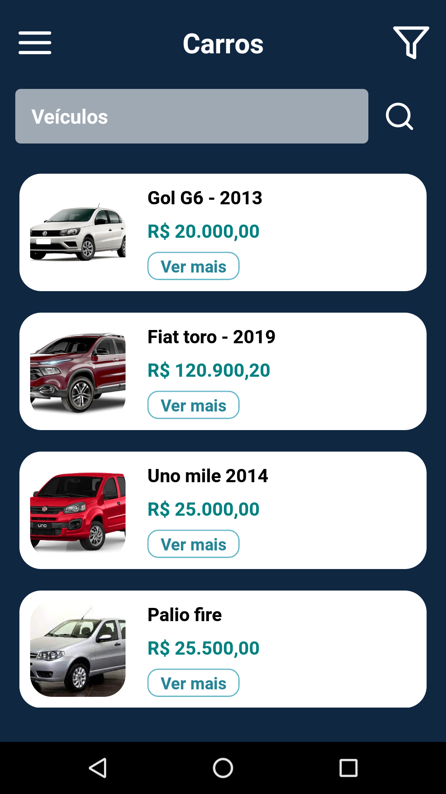
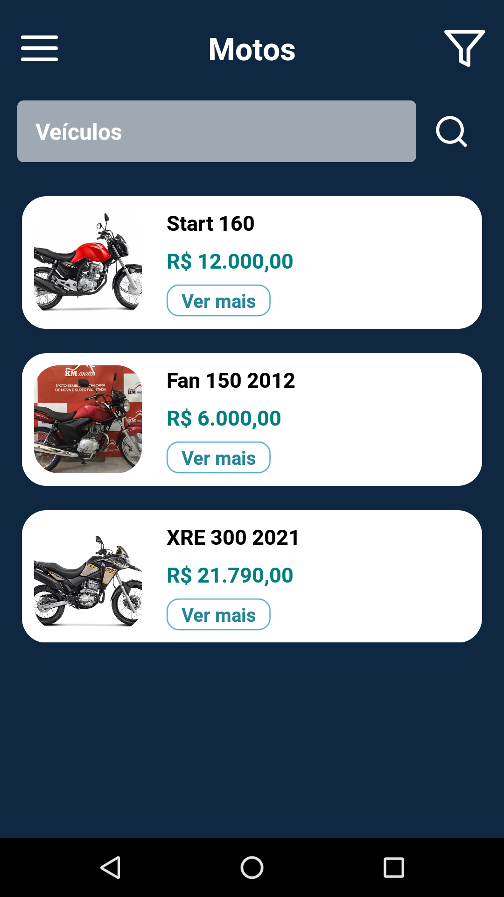
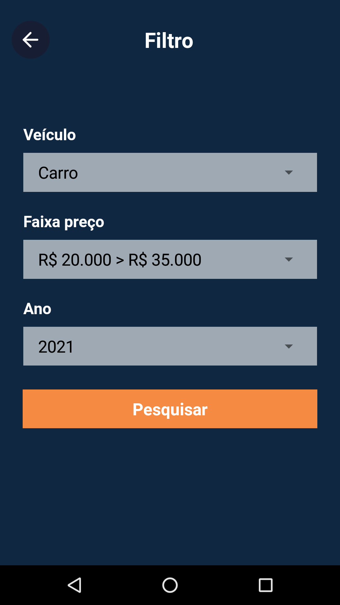
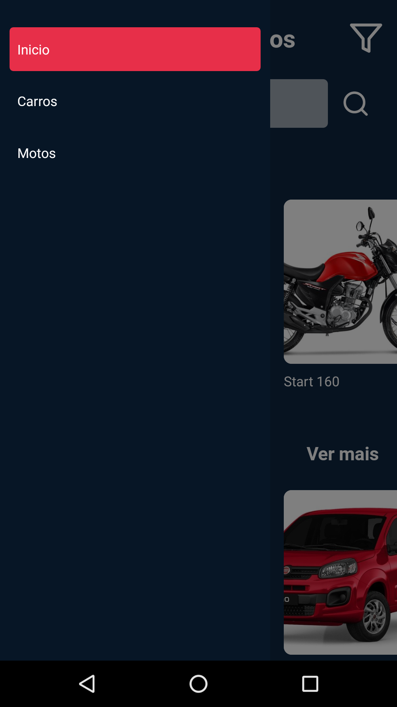

# Catálogo Veículos React native expo

Projeto de um aplicativo mobile para exibir um catálogo de veículos à venda. Consumindo dados da api <a href="https://github.com/cesar99144/Api-CatalogosVeiculos-NodeJS" target="_blank">Api catálogo veículos-nodejs</a>. 

    
    
    
    

    
    
    
    

<h3>Foi utilizado:</h3>
<ul>
    <li>React native expo</li>
    <li>Axios para as requisições HTTP</li>  
</ul>

<h3>Requisitos instalação:</h3>
    <blockquote>
       <ul>
        <li>Expo instalado</li>
        <li>Npm do node para caso precise rodar algum pacote</li>
        <li>Node.js para executar a api</li>
       </ul>
        
       É fundamental que a <a href="https://github.com/cesar99144/Api-CatalogosVeiculos-NodeJS" target="_blank">api</a> do projeto esteja instalada em seu computador rodando no localhost:4000. Caso queira rodar a api em outra porta, altere a url do localhost na pasta <code>src\services\api.js</code>
    </blockquote>
    <blockquote>
       No projeto acessei a api no emulador utilizando o endereço ip local e a porta da api, por exemplo: <code>http://192.168.1.6:4000</code> Para conseguir executar seria necessário ajustar esses valores de acordo com seu ambiente de desenvolvimento
    </blockquote>